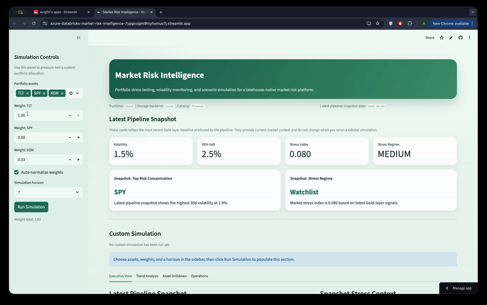
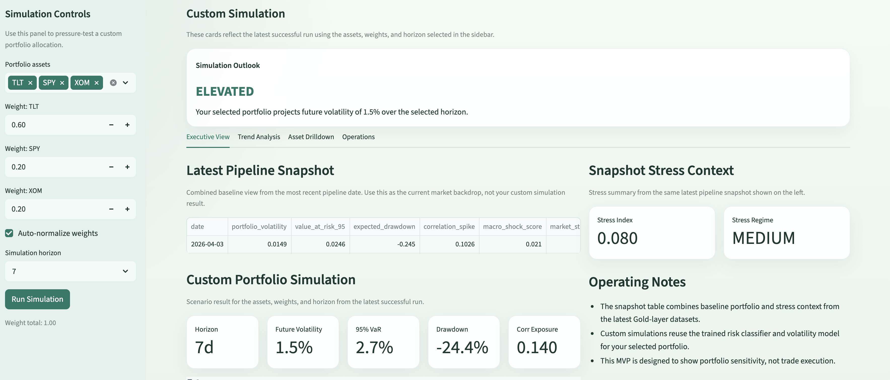
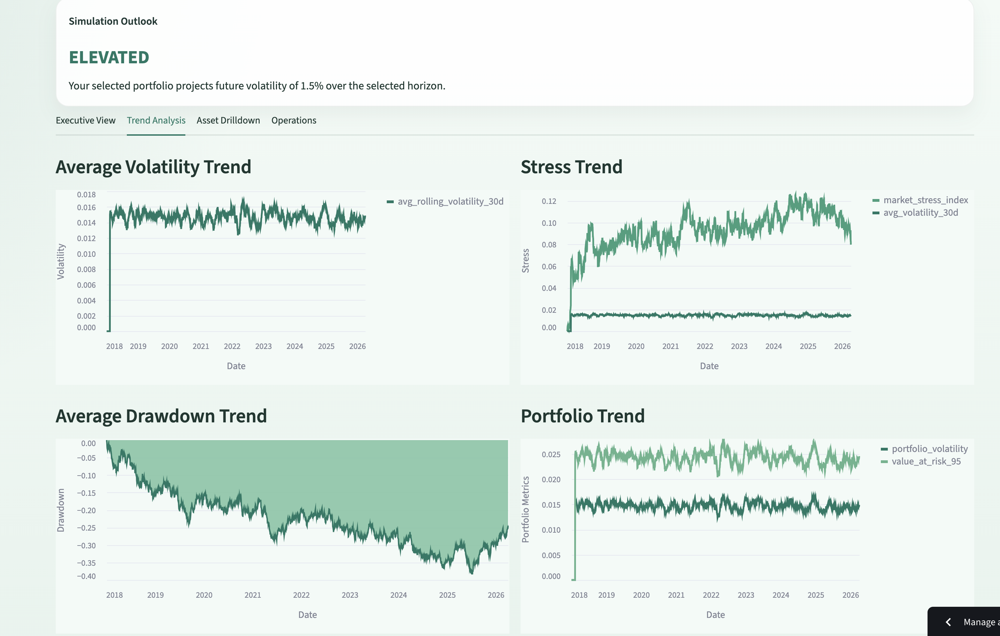

# Azure Databricks Market Risk Intelligence Platform

A lakehouse-native financial risk intelligence system built on **Azure + Databricks** that ingests market data, computes advanced risk signals, trains ML models for forward-looking volatility prediction, and allows users to simulate portfolios to evaluate downside exposure in real time.

The system combines **Delta Lake engineering, distributed Spark analytics, financial risk modeling, and portfolio simulation** to replicate the type of platform used by modern bank risk teams.

---

# TLDR

Azure Databricks financial risk platform.

Features:

- Lakehouse architecture built on Azure Data Lake + Delta Lake
- Distributed Spark pipelines for large-scale financial data processing
- Financial risk metrics (volatility, drawdowns, Value-at-Risk)
- Portfolio risk simulation engine
- ML models for future volatility forecasting and binary portfolio risk regime classification
- Feature Store + MLflow model lifecycle
- Real-time market stress detection
- Interactive dashboard for portfolio experimentation

---

# Live Application - Streamlit Market Intelligence Explorer

[](https://azure-databricks-market-risk-intelligence-7ypgxvjgm9htyhxmuo7j.streamlit.app/)


Live app:

https://azure-databricks-market-risk-intelligence-7ypgxvjgm9htyhxmuo7j.streamlit.app/

This production-deployed Streamlit application demonstrates the Gold-layer portfolio risk views in action, including:

- portfolio risk overview
- market stress trend analysis
- asset-level risk exploration
- portfolio simulation using the packaged model artifacts
- operational health and deployment context views

# App Preview

Interactive demo:



Screenshot highlights:





---

# Why This Project Exists

Modern banks operate lakehouse-based risk platforms to analyze portfolio exposure across thousands of assets and macroeconomic signals.

Risk teams need to answer questions like:

- Which assets are becoming unusually volatile?
- Which portfolios are most vulnerable to market shocks?
- What downside risk does a portfolio face tomorrow?
- How does a new asset allocation change portfolio risk?

This project demonstrates how to build such a system using Azure Databricks as the central data + ML platform.

---

# Key Innovation — Portfolio Simulation Engine

Most analytics platforms compute risk metrics after a portfolio already exists.

This system introduces a portfolio simulation engine that allows users to:

- Construct hypothetical portfolios
- Allocate weights across assets
- Simulate future risk metrics
- Predict volatility and downside exposure

This allows scenario-driven portfolio experimentation, similar to tools used by institutional risk desks.

Example simulation question:

> "If I build a portfolio with 60% TLT, 20% SPY, and 20% XOM, does the 7-day outlook stay stable or move into an elevated risk regime?"

---

# System Architecture

Market Data Sources  
(Yahoo Finance / FRED / Macro indicators)

```
Market Data Sources
(Yahoo Finance / FRED / Macro indicators)

            │
            ▼
Azure Data Factory / API ingestion

            │
            ▼
Azure Data Lake Storage (ADLS Gen2)

            │
            ▼
Azure Databricks

Bronze Layer
Raw financial data

Silver Layer
Cleaned financial datasets

Gold Layer
Risk features + signals

            │
            ▼
Databricks Feature Store

            │
            ▼
ML Models
(volatility prediction + risk regime classification)

            │
            ▼
Portfolio Simulation Engine

            │
            ▼
Interactive Risk Dashboard
```

---

# AWS Equivalent Architecture

If you want to explain the same platform in AWS terms, the closest equivalent architecture looks like this:

| Azure + Databricks Component | AWS Equivalent |
| --- | --- |
| Azure Data Factory | AWS Glue workflows, Lambda, or Step Functions for orchestration |
| Azure Data Lake Storage Gen2 | Amazon S3 data lake |
| Azure Databricks | Databricks on AWS or Amazon EMR for Spark workloads |
| Delta Lake on ADLS | Delta Lake on S3 |
| Unity Catalog | Unity Catalog on AWS or AWS Glue Data Catalog |
| Azure Event Hub | Amazon Kinesis Data Streams |
| Azure Key Vault | AWS Secrets Manager |
| Databricks SQL Warehouse | Databricks SQL on AWS or Amazon Athena/Redshift depending on query model |

AWS-oriented flow:

```
Market Data Sources
(Yahoo Finance / FRED / Macro indicators)

            │
            ▼
AWS Glue / Lambda / Step Functions ingestion

            │
            ▼
Amazon S3

            │
            ▼
Databricks on AWS or Amazon EMR

Bronze Layer
Raw financial data

Silver Layer
Cleaned financial datasets

Gold Layer
Risk features + signals

            │
            ▼
Feature Store / MLflow

            │
            ▼
ML Models
(volatility prediction + risk regime classification)

            │
            ▼
Portfolio Simulation Engine

            │
            ▼
Interactive Risk Dashboard
```

The business workflow stays the same across clouds: ingest market and macro data, land it in an object-store-backed lakehouse, transform it with Spark, train risk models, and serve simulation results through a dashboard. The main change is the cloud service mapping, not the analytical design.

---

# Technology Stack

## Cloud Infrastructure

- Azure Data Lake Storage Gen2
- Azure Databricks
- Azure Data Factory
- Azure Event Hub (optional streaming)
- Azure Key Vault

## Lakehouse

- Delta Lake
- Unity Catalog
- Databricks SQL Warehouse

## Data Processing

- Apache Spark
- PySpark
- dbt
- Structured Streaming

## Machine Learning

- MLflow
- XGBoost
- Scikit-learn

## Application Layer

- Streamlit dashboard
- Databricks notebooks

## Infrastructure as Code

- Terraform
- Databricks Asset Bundles

## Transformation Framework

- dbt for SQL-friendly silver/gold transformations
- Python for ingestion, specialized correlation generation, and ML training

---

# Data Sources

The platform ingests real financial market data from publicly available APIs and macroeconomic datasets.

These datasets simulate the type of multi-source data pipelines used by institutional risk platforms.

---

## 1. Equity and ETF Price Data

Source: **Yahoo Finance API** (via `yfinance`)

Data includes:

- daily open, high, low, close prices
- adjusted close
- trading volume

Example assets:

- AAPL — Apple
- MSFT — Microsoft
- NVDA — Nvidia
- XOM — Exxon Mobil
- SPY — S&P 500 ETF
- TLT — US Treasury Bond ETF

Example ingestion:

```python
import yfinance as yf

data = yf.download(
    ["AAPL","MSFT","NVDA","XOM","SPY"],
    start="2010-01-01"
)
```

This dataset forms the basis for:

- return calculations
- volatility estimates
- drawdown detection

---

## 2. Market Indices

Source: **Yahoo Finance**

Example indices:

- S&P 500
- Nasdaq Composite
- Dow Jones Industrial Average
- VIX (volatility index)

These indices provide macro-level signals used for:

- market stress detection
- correlation modeling
- systemic risk indicators

---

## 3. Macroeconomic Indicators

Source: **Federal Reserve Economic Data (FRED)**

Key indicators include:

- Federal Funds Rate
- Consumer Price Index (CPI)
- Unemployment Rate
- Treasury yields
- Credit spreads

Example ingestion:

```python
from fredapi import Fred

fred = Fred(api_key="YOUR_API_KEY")
interest_rates = fred.get_series("FEDFUNDS")
```

These variables are used to build **macro risk features** for ML models.

---

## 4. Volatility Signals

Source: **CBOE / Yahoo Finance**

Key volatility indicators:

- VIX
- sector volatility ETFs

These signals help detect:

- market regime shifts
- risk spikes
- stress conditions

---

## 5. Optional Streaming Market Data

For real-time extensions, the system can ingest streaming market feeds via:

- Alpha Vantage API
- Polygon API
- Azure Event Hub

These streams enable real-time monitoring of:

- volatility spikes
- large drawdowns
- abnormal trading activity

---

# Data Ingestion Pipeline

The ingestion pipeline is orchestrated using **Azure Data Factory** and scheduled Databricks jobs.

Workflow:

Market APIs  
→ Azure Data Factory ingestion  
→ Azure Data Lake Storage (Bronze)  
→ Databricks Spark transformations (Silver)  
→ Feature engineering + ML features (Gold)

Raw datasets are stored in **Delta Lake Bronze tables**, preserving the original structure for reproducibility.

---

# Lakehouse Architecture

The system follows a **Delta Lake medallion architecture**.

---

# Bronze Layer

Raw market data ingestion.

Tables:

- bronze.stock_prices
- bronze.market_indices
- bronze.macro_indicators

Data includes:

- historical asset prices
- index performance
- macroeconomic indicators
- trading volumes

Bronze tables are **append-only** and preserve the original event structure.

---

# Silver Layer

Cleaned and normalized financial datasets.

Tables:

- silver.daily_returns
- silver.volatility_metrics
- silver.market_correlations
- silver.asset_drawdowns

Transformations include:

- price normalization
- daily return calculations
- rolling volatility
- correlation matrices
- drawdown detection

---

# Gold Layer

Risk analytics tables used by ML and simulation.

Tables:

- gold.asset_risk_features
- gold.market_stress_signals
- gold.portfolio_risk_metrics

These tables represent the **core analytical layer of the platform**.

---

# Financial Risk Metrics

The platform computes several core financial indicators.

---

## Volatility

Rolling volatility calculated from daily returns.

σ = standard deviation of returns

Windows:

- 7-day
- 30-day
- 90-day

---

## Drawdown

Measures **peak-to-trough decline**.

Used to detect:

- sudden market crashes
- sustained downward trends

---

## Value at Risk (VaR)

Estimates **worst-case expected loss**.

Example:

95% Daily VaR

This represents the loss threshold that should not be exceeded **95% of the time**.

---

## Market Stress Index

A composite indicator combining:

- volatility spikes
- correlation spikes
- drawdowns
- macro shocks

This index acts as a **global market risk signal**.

---

# Feature Engineering

Risk features are engineered for ML models.

| Feature | Description |
|--------|-------------|
| rolling_volatility_30d | asset risk intensity |
| rolling_drawdown | downside exposure |
| correlation_spike | systemic risk indicator |
| momentum_signal | trend continuation |
| macro_shock_score | macroeconomic volatility |

These features are stored in the **Databricks Feature Store**.

---

# Machine Learning Models

The system trains two models.

---

## Model 1 — Asset Volatility Predictor

Predicts expected volatility in the next **7 days**.

Target:

future_volatility_7d

Features:

- rolling volatility
- macro indicators
- momentum signals
- correlation signals

Algorithm:

**XGBoost regression**

---

## Model 2 — Binary Portfolio Risk Regime Classifier

Classifies portfolios into:

- STABLE
- ELEVATED

Features include:

- portfolio volatility
- correlation exposure
- macro risk signals
- sector concentration

Algorithm:

**Random Forest or XGBoost classifier**

---

# Portfolio Simulation Engine

The portfolio simulation engine is a **novel component of the system**.

Users can define hypothetical portfolios and evaluate risk metrics instantly.

---

## Inputs

User defines:

- asset list
- weight allocation
- time horizon

Example:

Portfolio

AAPL: 40%  
XOM: 30%  
TLT: 30%

---

## Simulation Outputs

The system calculates:

- portfolio volatility
- Value-at-Risk
- expected drawdown
- ML risk regime prediction
- correlation exposure

This allows experimentation with different asset allocations **before committing capital**.

---

# dbt Transformation Layer

The project now includes a lightweight **dbt** project in [dbt/](/Users/vikasvig/Desktop/portfolio_projects/azure-databricks-market-risk-intelligence/dbt) for SQL-oriented lakehouse transformations.

The dbt layer covers:

- `silver_daily_returns`
- `silver_volatility_metrics`
- `silver_asset_drawdowns`
- `gold_asset_risk_features`
- `gold_market_stress_signals`
- `gold_portfolio_risk_metrics`

The platform uses a hybrid transformation strategy:

- Python handles market ingestion, specialized rolling correlation generation, and ML orchestration
- dbt handles the SQL-friendly silver/gold transforms that fit naturally into a declarative analytics layer

---

# Real-Time Risk Signals

The system detects market anomalies using **streaming signals**.

Examples:

- volatility spikes
- sudden correlation increases
- large drawdowns

These signals trigger alerts such as:

> "Technology sector volatility spike detected"

This simulates monitoring tools used by **trading desks**.

---

# Governance

The platform uses **Unity Catalog** for governance.

Catalog structure:

```
finance.bronze
finance.silver
finance.gold
```

Governance features include:

- table lineage
- role-based permissions
- data cataloging

These capabilities are essential in **regulated financial environments**.

---

# Dashboard

A **Streamlit dashboard** provides an interface for exploring risk metrics.

Pages include:

## Portfolio Risk Overview

- volatility
- drawdown
- VaR

## Market Stress Signals

- stress index
- volatility spikes

## Portfolio Simulation

- custom portfolio builder
- risk predictions

## Asset Risk Explorer

- volatility trends
- correlation networks

---

# Project Structure

```
azure-databricks-risk-platform/

infra/
    terraform/

data_ingestion/
    market_data_pipeline.py

lakehouse/
    bronze_pipeline.py
    silver_transformations.py
    gold_feature_builder.py

features/
    feature_store_builder.py

ml/
    train_volatility_model.py
    train_risk_classifier.py

simulation/
    portfolio_simulator.py

streaming/
    market_signal_detection.py

dashboard/
    app.py

docs/
    architecture.md
```

---

# Example Questions the System Can Answer

- Which assets are currently experiencing the highest volatility?
- Which sectors are driving market stress?
- What is the predicted volatility of an asset next week?
- What is the risk tier of a given portfolio?
- How does changing asset weights affect downside exposure?

---

# Running the Project

Install dependencies:

```
pip install -r requirements.txt
```

Optional dbt dependencies:

```
pip install -r requirements-dbt.txt
```

Copy environment defaults:

```
cp .env.example .env
```

Local datasets default to `parquet` via `LOCAL_STORAGE_FORMAT=parquet`, while logical table contracts remain Databricks/Delta-compatible.

Run the pipeline locally with deterministic sample data:

```
PYTHONPATH=src python -m market_risk_platform.main ingest
PYTHONPATH=src python -m market_risk_platform.main silver
PYTHONPATH=src python -m market_risk_platform.main gold
PYTHONPATH=src python -m market_risk_platform.main features
PYTHONPATH=src python -m market_risk_platform.main train-volatility
PYTHONPATH=src python -m market_risk_platform.main train-classifier
PYTHONPATH=src python -m market_risk_platform.main simulate
```

Run the full local build in one command:

```
PYTHONPATH=src python -m market_risk_platform.main run-all
```

Run a custom portfolio simulation:

```
PYTHONPATH=src python -m market_risk_platform.main simulate --assets AAPL,MSFT,TLT --weights 0.5,0.3,0.2 --horizon 30
```

Run data ingestion:

```
PYTHONPATH=src python -m market_risk_platform.data_ingestion.market_data_pipeline
```

Build lakehouse tables:

```
PYTHONPATH=src python -m market_risk_platform.lakehouse.silver_transformations
PYTHONPATH=src python -m market_risk_platform.lakehouse.gold_feature_builder
```

Build the dbt transformation layer:

```
cd dbt
cp profiles.yml.example ~/.dbt/profiles.yml
dbt debug
dbt build
```

Train models:

```
PYTHONPATH=src python -m market_risk_platform.ml.train_volatility_model
PYTHONPATH=src python -m market_risk_platform.ml.train_risk_classifier
```

Launch dashboard:

```
PYTHONPATH=src streamlit run streamlit_app.py
```

Inspect a CLI dashboard payload summary:

```
PYTHONPATH=src python -m market_risk_platform.main dashboard-summary
```

Inspect an operational health report:

```
PYTHONPATH=src python -m market_risk_platform.main health-check
```

Verify the deployment/runtime contract:

```
PYTHONPATH=src python -m market_risk_platform.main verify-deployment
```

Databricks deployment scaffold:

```
cd databricks
databricks bundle validate
databricks bundle deploy -t dev
```

Python package build metadata is defined in `pyproject.toml`, and the Databricks jobs are configured to use a built wheel artifact rather than only workspace notebooks.

To bridge Terraform outputs into Databricks bundle variables:

```bash
cd infra/terraform
terraform output -json > /tmp/market-risk-tf-output.json
cd ../..
python3 scripts/render_bundle_vars.py /tmp/market-risk-tf-output.json
```

Or generate the full Databricks deploy command directly:

```bash
python3 scripts/deploy_bundle.py --target dev
```

Terraform scaffold:

```
cd infra/terraform
cp env/dev.mvp.tfvars.example env/dev.tfvars
terraform init
terraform plan -var-file=env/dev.tfvars
```

For the fastest MVP path, keep `enable_eventhub=false` in `dev` unless you specifically need streaming proof.

CI workflow:

```
.github/workflows/ci.yml
```

It builds the wheel, checks Terraform formatting, runs the Python test suite, and smoke-tests the deployment helper scripts.

Manual deployment workflow:

```
.github/workflows/deploy.yml
```

It provides a controlled GitHub Actions path for Terraform plan/apply and Databricks bundle validation using environment secrets.

---

# MVP Deployment Story

This project now supports two polished delivery surfaces:

1. a real Azure + Databricks backend provisioned with Terraform and deployed with Databricks Asset Bundles
2. a Streamlit dashboard that can demo the platform immediately in sample-data mode using the bundled Gold-layer datasets and trained model artifacts

This keeps the portfolio story strong on both dimensions:

- Azure + Databricks show production-style cloud architecture, infrastructure-as-code, and job packaging
- Streamlit Community Cloud provides a public user-facing analytics demo

Provisioned Azure resources:

- Resource group: `rg-market-risk-intelligence-dev`
- Storage account: `mriskinteldev001`
- Key Vault: `kvmriskdev001`
- Azure Databricks workspace: `adb-7405616390463908.8.azuredatabricks.net`

Recommended Streamlit Community Cloud settings:

```bash
Main file path: streamlit_app.py
Python version: 3.11
```

---

# Deployment Evidence

Add these proof points before final submission:

- screenshot of the Azure resource group and key services
- screenshot of the Databricks workspace and deployed jobs
- screenshot of the Streamlit dashboard
- sample output from `health-check`
- sample output from `verify-deployment`
- sample portfolio simulation result

Verification placeholders:

```text
Azure resource group:
Databricks workspace URL:
Streamlit app URL:
Latest health-check result:
Latest verify-deployment result:
```

---

# Model Evaluation

The repository includes persisted evaluation metrics for the shipped sample model artifacts:

- Volatility forecasting model:
  `MAE = 0.00342`, `RMSE = 0.00425`, `R² = 0.307`
- Portfolio risk classifier:
  `Accuracy = 66.90%`, `Macro F1 = 0.657`

These scores are produced from a time-based holdout rather than a random row split:

- the volatility model predicts future 7-day asset volatility from current risk features
- the classifier predicts a binary future portfolio volatility regime (`STABLE` vs `ELEVATED`) from current portfolio features

In practice, the volatility model is the stronger predictive component, while the classifier is best interpreted as a forward-looking portfolio stress flag for scenario analysis.

These metrics come from:

- `data/sample/artifacts/volatility_model_metrics.csv`
- `data/sample/artifacts/risk_classifier_metrics.csv`

The application layer is validated through the operational commands below:

```bash
PYTHONPATH=src python -m market_risk_platform.main dashboard-summary
PYTHONPATH=src python -m market_risk_platform.main health-check
PYTHONPATH=src python -m market_risk_platform.main verify-deployment
```

Together, these checks confirm that:

- Gold-layer datasets are readable
- model artifacts are present
- the dashboard payload can be generated
- the end-to-end local verification contract passes

---

# Future Extensions

Potential improvements include:

- reinforcement learning portfolio optimization
- macroeconomic scenario simulations
- option pricing models
- stress-testing under extreme market conditions
- integration with real-time trading APIs

---

# Why This Project Matters

This project demonstrates how modern financial institutions can build **lakehouse-native risk intelligence platforms** capable of combining:

- large-scale distributed analytics
- machine learning
- scenario-based portfolio simulation
- real-time risk monitoring

It showcases the use of **Azure Databricks as a unified platform for financial data engineering, ML, and risk analytics**.

It also shows how to translate the same platform into a public-facing analytics application, combining:

- cloud infrastructure provisioning on Azure
- Databricks job packaging and deployment
- portfolio simulation UX in Streamlit
- live or sample-backed demo modes for technical presentations and hiring portfolios
